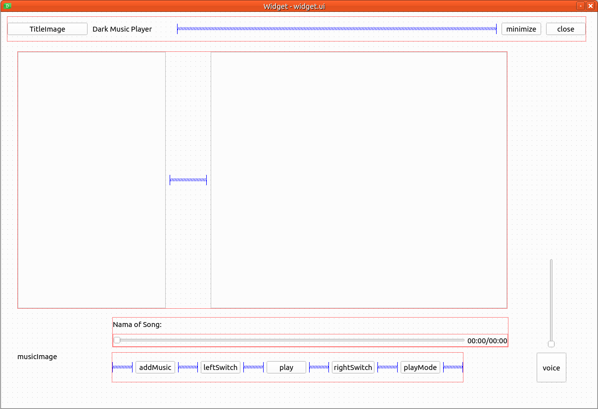
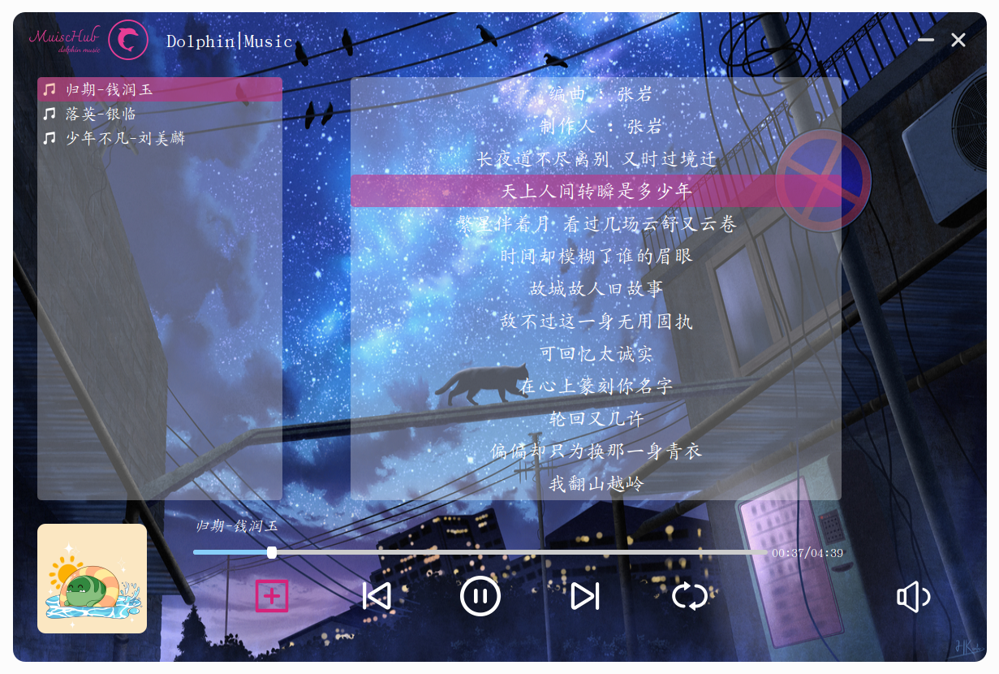

# Qt 音乐播放器

## 环境

* 平台: Ubuntu22.04
* 框架: Qt6.6
* 开发工具: CMake, nvim
* 数据库: sqlite3

## 功能

包含添加歌曲、播放歌曲、切换歌曲、切换模式、播放进度条、音量进度条、显示歌曲/歌词等功能

## 界面

使用`designer`画出大概的`ui`, 再利用`qss`和组件的`set`方法进行界面美化, `StyleSet`类中实现

## 数据库

数据库存储每首通过添加按钮添加的歌曲(id, url, name, author, album)

当消息队列解析完一首歌之后, 会将上述4个歌曲属性存入数据库

当工作类对象初始化完成后, 会将数据库中的歌曲属性读入消息队列, 即恢复上一次的播放列表

## 主要的类

* `DatabaseManager`: 用于管理数据库操作, 采用单例模式, 例如数据库的连接, 建表, 插入, 查询
* `MessageQueue`: 消息队列, 采用单例模式, 用于存放解析完成的歌曲对象地址, 再交由歌曲管理者管理
* `SongManager`: 歌曲管理者, 采用单例模式, 管理一个歌曲列表, 即所有歌曲的元信息
* `Worker`: 一个工作类, 负责解析歌曲元信息、歌词、保存歌曲至数据库、从数据库加载歌曲至播放列表(在子线程完成操作)
* `MusicPlayer`: 一个媒体管理类, 采用单例模式, 用于歌曲播放/暂停/换源的操作 [Qt6已经将`QMediaPlayerList`删除]

*主要流程: 显示界面 --> 添加歌曲 --> 交由工作类解析歌曲(子线程) --> 解析完成的歌曲交由消息队列
--> 再由消息队列交由歌曲管理者/以及数据库管理者 --> 交由播放媒体 --> 点击播放按钮播放歌曲*

*第二次打开 --> 初始化工作类 --> 从数据库读取歌曲 --> 恢复上一次列表*

## 效果展示

## 界面设计参考

https://github.com/NJU-TJL/Qt5-MusicPlayer

## 素材来源

* https://www.iconfont.cn/
* https://www.pixiv.net/

